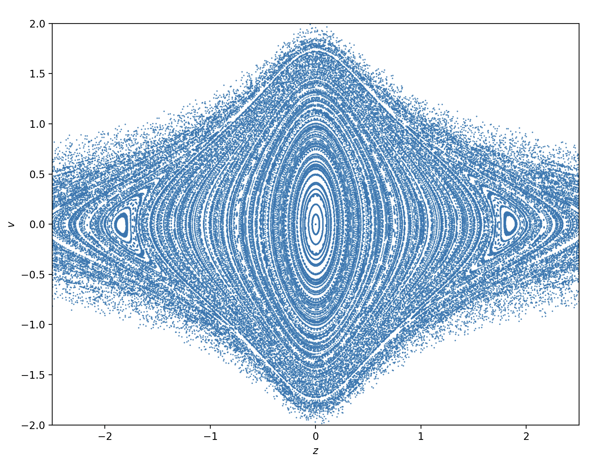
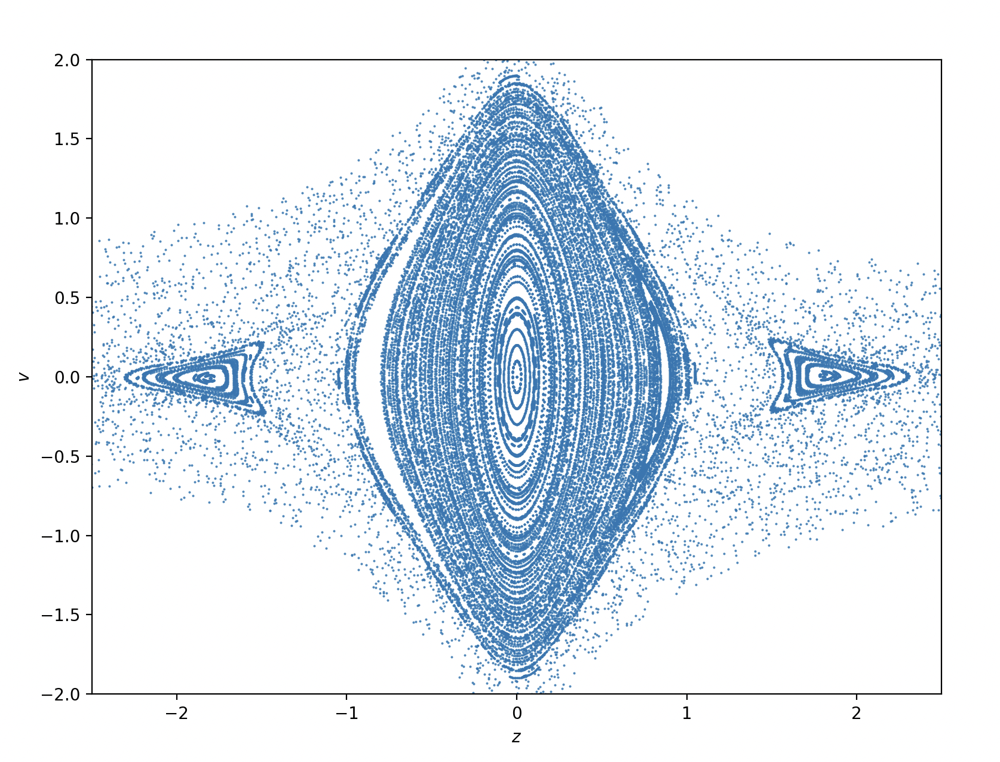

# sitnikov-solver
Sitnikov problem solver for elliptical orbits





## Get and build

```
git clone --recurse-submodules https://github.com/SeverinDenisenko/sitnikov-solver.git
cd sitnikov-solver
mkdir build
cd build
cmake .. -DCMAKE_BUILD_TYPE=Release
make -j 8
cd ..
```

## Create phase portraits

First look into config.yaml

```
./build/bin/sitnikov_app > portrait.txt
./plot_portrait.py
```

Or

```
./build/bin/poincare_app > portrait.txt
./plot_portrait.py
```
